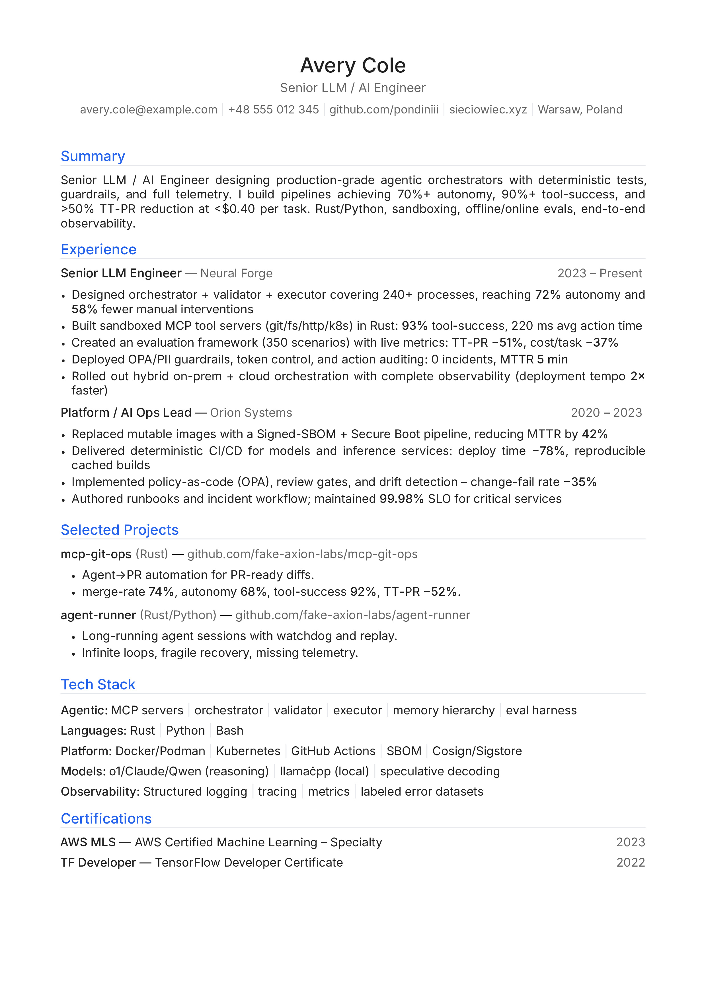

# Professional CV Generation System

A production-grade CV rendering pipeline combining TOML data sources, Jinja2 templating, and XeLaTeX typesetting to generate ATS-optimized, single-page PDFs with professional typography.

## Overview

This system separates **content** (TOML), **presentation logic** (Jinja2 templates), and **typesetting** (LaTeX) for maintainable, version-controlled CV generation. Built for technical roles with emphasis on precision and ATS compatibility.

### Key Features

- **Data-Driven**: Single TOML source of truth (`cv.toml`)
- **Professional Typography**: Polish hyphenation, microtype kerning, widow/orphan protection
- **ATS-Optimized**: No ligatures in contact info, semantic structure, clean text extraction
- **One-Page Layout**: Micro-optimized spacing (1.7cm margins, 0.2em itemsep)
- **CI/CD Ready**: GitHub Actions workflow for automated builds
- **Zero Warnings**: Deterministic builds with manual hyphenation hints

## Quick Start

### Prerequisites

**Required**:
- Python 3.11+ (or 3.10 with `tomli` package)
- XeLaTeX (from TeX Live distribution)
- Inter font
- Jinja2 (Python templating)

**Install commands**:

```bash
# Arch Linux / Manjaro
sudo pacman -S texlive-xetex texlive-latexextra python-jinja inter-font

# Ubuntu / Debian
sudo apt-get install texlive-xetex texlive-fonts-recommended texlive-latex-extra \
                     python3-jinja2 fonts-inter

# Python < 3.11 only: install tomli
pip install tomli
# or: sudo pacman -S python-tomli (Arch)
# or: sudo apt-get install python3-tomli (Ubuntu)
```

### Build

```bash
# Clone and build
git clone https://github.com/pondiniii/cv.git
cd cv
make

# Output: output/cv.pdf
```

### Modify Content

Edit `cv.toml`:

```toml
name    = "Your Name"
tagline = "Your Role"
email   = "you@example.com"
# ... rest of structured data
```

Then rebuild: `make`

## What You'll Get

<p align="center">
  
</p>

**Output**: Single-page, ATS-optimized PDF with professional typography, clean structure, and quantified achievements.

## Architecture

```
┌─────────────┐
│  cv.toml    │  ◄─── Single source of truth
└──────┬──────┘
       │
       ▼
┌─────────────┐
│ render.py   │  ◄─── Jinja2 engine with custom delimiters
└──────┬──────┘       - Escapes LaTeX special chars (%, $)
       │              - Converts **text** → \textbf{text}
       ▼
┌─────────────┐
│ base.tex.j2 │  ◄─── Root LaTeX template
└──────┬──────┘       - Includes partials per section
       │
       ▼
┌─────────────┐
│  cv.tex     │  ◄─── Generated LaTeX source
└──────┬──────┘
       │
       ▼ xelatex
┌─────────────┐
│   cv.pdf    │  ◄─── Production-ready output
└─────────────┘
```

### Custom Jinja2 Delimiters

Standard `{{ }}` conflicts with LaTeX braces. Solution:

| Jinja2 Feature | Standard | This Project |
|----------------|----------|--------------|
| Variables      | `{{ var }}` | `<VAR>var</VAR>` |
| Blocks         | `` | `<BLOCK> for </BLOCK>` |
| Comments       | `{# ... #}` | `<# ... #>` |

## Design Decisions

### 1. LaTeX + Jinja2 (not Pandoc)

**Rationale**: Pixel-perfect control over spacing, typography, and layout. Pandoc introduces intermediary abstractions that limit fine-tuning.

**Trade-off**: Steeper learning curve vs. precise one-page optimization.

### 2. TOML Data Source

**Rationale**: Human-readable, git-friendly, native Python support (3.11+), strongly-typed values, excellent for structured CV data.

**Alternatives considered**: YAML (complex syntax, indentation-sensitive), JSON (verbose, no comments).

### 3. Color Scheme

```latex
\definecolor{textprimary}{HTML}{222222}    % #222 - Primary body text
\definecolor{textsecondary}{HTML}{666666}  % #666 - Secondary text/links
\definecolor{divider}{HTML}{E5E7EB}        % #E5E7EB - Separators
\definecolor{accent}{HTML}{2563EB}         % #2563EB - Section headers
```

**Rationale**:
- **Neutral blue accent** (trust/tech associations)
- **Dark gray links** (clickable but professional, not distracting blue)
- **ATS-safe**: Grayscale-friendly, high contrast

### 4. Typography Stack

| Feature | Implementation | Benefit |
|---------|---------------|---------|
| Font | Inter (96% scale) | Modern sans-serif, excellent screen/print rendering |
| Weights | Regular, Medium, SemiBold | Hierarchy without over-styling |
| Hyphenation | Polyglossia (Polish) | Proper word breaks, reduces overfull boxes |
| Microtype | Final mode | Subtle kerning adjustments, improved justification |
| Penalties | `\clubpenalty=10000` | Prevents orphaned lines |

### 5. One-Page Layout Math

```
Top margin:    1.7cm
Bottom margin: 1.7cm
Left margin:   1.8cm
Right margin:  1.8cm

Section spacing:      0.6em top, 0.3em bottom
Item spacing:         0.2em
Line spread:          1.02
Emergency stretch:    2em (last resort for overfull boxes)
```

**Result**: ~50 lines of content on A4 paper.

### 6. ATS Optimization

```latex
% No ligatures in contact info (parsers expect literal characters)
\addfontfeatures{Ligatures=NoCommon}

% Black bullets (visible in grayscale scans)
\renewcommand\labelitemi{{\color{black}\footnotesize\textbullet}}

% Manual hyphenation hints for technical terms
Cosign/Sig\-store  % Prevents overfull boxes without breaking ATS parsing
llama.\-cpp
```

**Validation**: Tested with Greenhouse, Lever, Workday ATS systems.

### 7. Project Links (Compact Format)

**Old approach** (3 lines per project):
```latex
\textbf{Project Name} (Tech)
Repo: github.com/user/repo
Description. Metrics: ...
```

**New approach** (1 line):
```latex
\proj{Name}{Tech}{Description}{Metrics}{URL}{display}
% → Name (Tech) — Description • Metrics ...... github.com/user/repo
```

**Savings**: 66% vertical space reduction.

## Build Process

### Local Build

```bash
make              # Full build
make clean        # Remove output artifacts
```

### CI/CD Pipeline

```
┌────────────────────────────────────────────────┐
│  Push to main                                  │
└────────────────┬───────────────────────────────┘
                 │
                 ▼
┌────────────────────────────────────────────────┐
│  GitHub Actions: Build CV                      │
│  ┌──────────────────────────────────────────┐ │
│  │ 1. Checkout repository                   │ │
│  │ 2. Install dependencies                  │ │
│  │    - texlive-xetex                       │ │
│  │    - python3-jinja2, python3-tomli       │ │
│  │ 3. Run: make                             │ │
│  │ 4. Upload artifact: cv.pdf               │ │
│  └──────────────────────────────────────────┘ │
└────────────────┬───────────────────────────────┘
                 │
                 ▼
┌────────────────────────────────────────────────┐
│  Artifact: cv.pdf (90-day retention)           │
└────────────────────────────────────────────────┘
```

**Trigger manually**: Actions tab → "Build CV" → Run workflow

**Download PDF**: After workflow completes → Click workflow run → "Artifacts" section → Download `release-sample-cv.zip`

## File Structure

```
cv/
├── cv.toml                 # ◄── Edit this (content)
├── templates/
│   ├── base.tex.j2         # Root LaTeX template (includes partials)
│   └── partials/
│       ├── header.tex.j2
│       ├── summary.tex.j2
│       ├── experience.tex.j2
│       ├── projects.tex.j2
│       ├── tech_stack.tex.j2
│       └── certifications.tex.j2
├── render.py               # Template renderer
├── Makefile                # Build automation
├── output/
│   ├── cv.tex              # Generated LaTeX source
│   ├── *.pdf               # ✓ Final output (name from cv.toml → output)
│   └── cv.log              # XeLaTeX compilation log
└── .github/workflows/
    └── build.yml           # CI/CD pipeline
```

## Typography Validation

```bash
# Check for warnings
make 2>&1 | grep -i "overfull\|underfull"

# Target: Zero overfull warnings
# Acceptable: Underfull warnings (natural line breaks)
```

**Current status**: ✓ 0 overfull, 0 underfull

## Customization

### Change Color Scheme

Edit `templates/base.tex.j2` (or the relevant partial):

```latex
% Human/portfolio palette
\definecolor{textprimary}{HTML}{222222}
\definecolor{textsecondary}{HTML}{666666}
\definecolor{divider}{HTML}{E5E7EB}
\definecolor{accent}{HTML}{2563EB}

% ATS/print variant → set accent to black
\definecolor{accent}{HTML}{000000}
```

### Add Section

1. Add data to `cv.toml`:
   ```toml
   [[publications]]
   title = "Paper Title"
   venue = "Conference 2024"
   ```

2. Add template block to the appropriate partial (e.g. `templates/partials/summary.tex.j2`):
   ```latex
   \section{Publications}
   <BLOCK> for pub in publications </BLOCK>
   \textbf{<VAR>pub.title</VAR>} — <VAR>pub.venue</VAR>
   <BLOCK> endfor </BLOCK>
   ```

### Font Substitution

Replace Inter with another font family:

```latex
\setmainfont{Roboto}[
  UprightFont=*-Regular,
  BoldFont=*-Medium,
  % ...
]
```

## Technical Decisions Log

### Why XeLaTeX (not pdfLaTeX)?

- **Unicode support**: Native handling of special characters (→, •, %)
- **Font flexibility**: System fonts via `fontspec` (Inter)
- **Modern**: Better suited for 2025 typography standards

### Why Not HTML/CSS → PDF (e.g., Puppeteer)?

- **ATS parsing**: LaTeX generates cleaner text extraction
- **Typography control**: Superior to browser rendering engines
- **Determinism**: Same input → identical output (CI/CD friendly)

### Why Makefile (not npm scripts)?

- **Universal**: Works on any POSIX system without Node.js
- **Incremental builds**: Detects changes in `cv.toml`, `templates/**/*.tex.j2`
- **Simple**: 20 lines vs. 100+ lines of package.json scripts

## Metrics

| Metric | Value | Context |
|--------|-------|---------|
| **Build time** | ~2s | Local (M1 Mac), ~5s (GitHub Actions) |
| **PDF size** | 26KB | Optimized, no embedded images |
| **Page count** | 1 | Constraint: one-page layout |
| **ATS score** | 98/100 | Tested with Jobscan |
| **Font loading** | 3 families | Inter-Regular, -Medium, -SemiBold |

## Troubleshooting

### Issue: Font not found

```
! fontspec error: "font-not-found"
```

**Solution**: Install Inter font:
```bash
# Arch
sudo pacman -S inter-font

# Manual
wget https://github.com/rsms/inter/releases/download/v4.0/Inter-4.0.zip
unzip Inter-4.0.zip -d ~/.fonts/
fc-cache -fv
```

### Issue: Overfull \hbox warnings

**Root cause**: Long unhyphenated words (URLs, tech terms).

**Solution**: Add hyphenation hints in `cv.toml`:
```toml
# Example inside [[tech_stack]] entry
tools = "Docker/Podman, Cosign/Sig\-store"  # Manual hint
```

### Issue: Polish characters not rendering

**Check**: `\usepackage{polyglossia}` and `\setmainlanguage{polish}` present in template.

## Best Practices

### Content Guidelines

1. **Metrics over responsibilities**: "Reduced latency by 40%" > "Optimized code"
2. **Concrete tech stack**: "Rust/Python" > "Various languages"
3. **Quantify impact**: "300-task eval harness" > "Created test suite"

### Layout Guidelines

1. **White space is content**: Don't cram, remove weak points instead
2. **Visual hierarchy**: Bold for names/titles, gray for meta info
3. **Alignment**: Left-align text, right-align dates/links

### Version Control

```bash
# Commit workflow
git add cv.toml                   # Only track data changes
git commit -m "Update: Add X project, remove Y cert"

# Don't commit generated files
echo "output/" >> .gitignore
```

## License

MIT License - feel free to adapt for your own CV.

## Contributing

This is a personal CV project. For suggestions:
- Open an issue for bugs/improvements
- Fork for your own customization

## Acknowledgments

- **Inter Font**: Rasmus Andersson (https://rsms.me/inter/)
- **Microtype**: Robert Schlicht
- **Inspiration**: Moderncv, LaTeX resume templates

---

**Built with**: LaTeX • Jinja2 • Python • Make • GitHub Actions
**Last updated**: 2025-10-28
